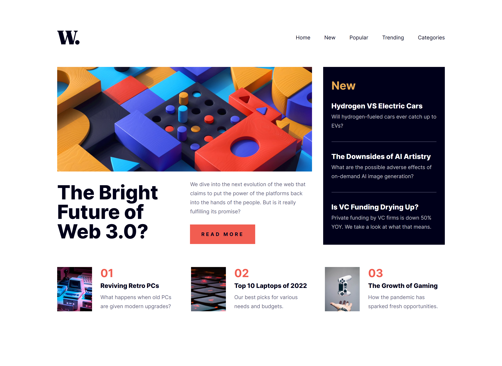

# Frontend Mentor - News homepage solution

This is a solution to the [News homepage challenge on Frontend Mentor](https://www.frontendmentor.io/challenges/news-homepage-H6SWTa1MFl). Frontend Mentor challenges help you improve your coding skills by building realistic projects.

## Table of contents

- [Overview](#overview)
  - [The challenge](#the-challenge)
  - [Screenshot](#screenshot)
  - [Links](#links)
- [My process](#my-process)
  - [Built with](#built-with)
  - [What I learned](#what-i-learned)
  - [Continued development](#continued-development)
- [Author](#author)

## Overview

### The challenge

Users should be able to:

- View the optimal layout for the interface depending on their device's screen size
- See hover and focus states for all interactive elements on the page

### Screenshot

### Links

- Solution URL: [https://github.com/Arsalan2078/news-homepage.git](https://github.com/Arsalan2078/news-homepage.git)
- Live Site URL: [https://mellifluous-pudding-83e991.netlify.app/](https://mellifluous-pudding-83e991.netlify.app/)

## My process

### Built with

- Semantic HTML5 markup
- CSS custom properties
- Flexbox
- CSS Grid
- Mobile-first workflow
- [Vite](https://vite.dev/) - JS Framework, using React.js

### What I learned

Got familiar with @container rule, which was necessary to make sure component styles changed in according to it's own width instead of the viewport width.

### Continued development

In the next project that features toggle-able mobile navigation menus, I will learn to apply animations to it effectively.

## Author

- Frontend Mentor - [@Arsalan2078](https://www.frontendmentor.io/profile/Arsalan2078)
